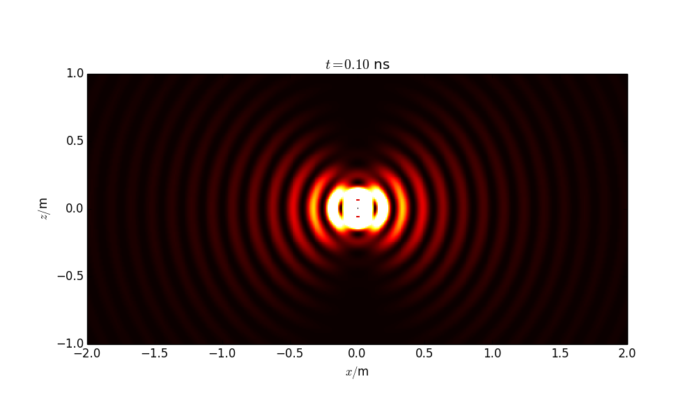

Dipole
======

`dipole.py` is a Python module that computes E and B fields of an Hertz Dipole.

The full fields are derived from the following formulas:

`RadiationPattern.py` is a sample program that shows how `dipole.py`can be used to compute the radiation pattern (in frequency domain) of a random set od dipoles on a sphere (non intentional arbitrary emitter).

##Requirements
* Python 2.x
* Numpy
* Matplotlib (for the `main()` sample program of `dipole.py`and for `RadiationPattern.py`)

##Applications
###Dipole radiation in time-domain: `main()` of `dipole.py`
The `main()` function of `dipole.py` returns an image sequence that shows the time domain radiation of a dipole (total power radiated)

###Radiation pattern of a random set of dipoles: `RadiationPattern.py`
In this sample program, a random object is generated (a random set of dipoles). The radiation pattern is computed and rendered for every frequency.

Output samples:

